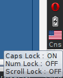

What is it?
===========

This is a keyboard leds plugin (based on sample plugin) for the Xfce panel.




Installation
============

You should have
- xfce4-dev-tools
- libxfce4panel-2.0-dev
- libxfce4ui-2-dev

Then run
```
./autogen.sh
./configure --prefix=/usr
sudo make install
```

On some distros you need to specify plugin directories by yourself like this
```
./configure --prefix=/usr --libdir=/usr/lib/x86_64-linux-gnu
```

Enjoy!
